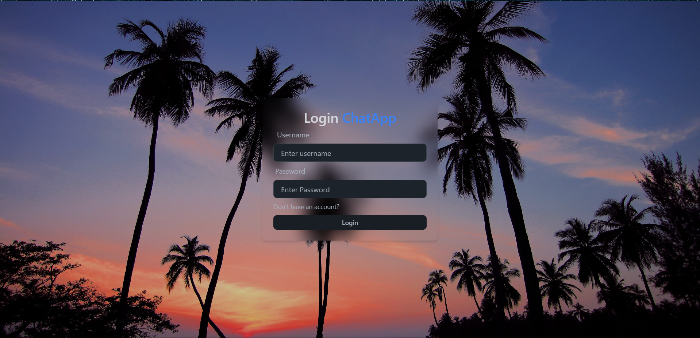
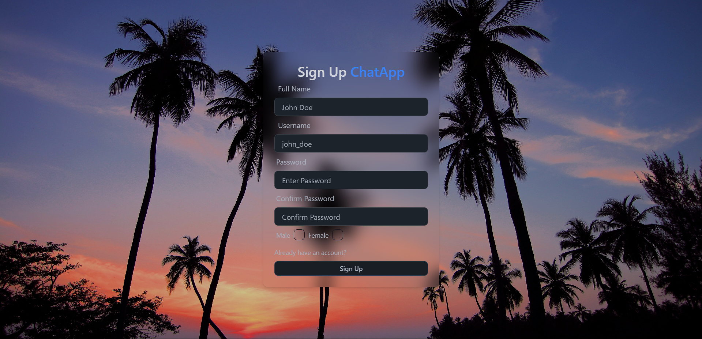
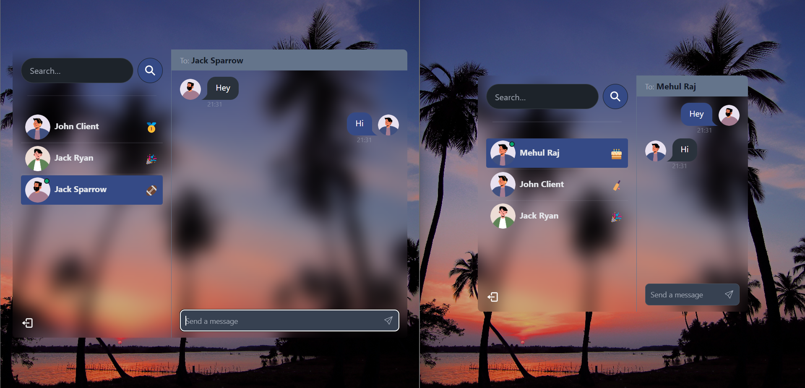

# Chat App

A real-time chat application built with the MERN stack. The app includes user authentication, real-time messaging, online user status, global state management, and robust error handling.

## Features

- **🔒 Authentication & Authorization**: Secure login and registration using JWT.
- **💬 Real-time Messaging**: Instant messaging capabilities powered by Socket.io.
- **🟢 Online User Status**: Track and display online users using Socket.io and React Context.
- **📦 Global State Management**: Manage application state with Zustand.
- **🐞 Error Handling**: Comprehensive error handling on both the server and the client.

## Deployment

Check out the live app [here](https://chat-app-tp09.onrender.com).

## Screenshots

### Login Page



### SignUp Page



### Chat Interface



## Installation

1. Clone the repository
   ```bash
   git clone https://github.com/MrM-7/Chat-App.git
   ```
2. Install dependencies
   ```bash
   cd Chat-App
   npm install
   cd frontend
   npm install
   ```
3. Create a `.env` file in the root directory and add your environment variables
   ```env
   MONGODB_URI=your_mongodb_connection_string
   ACCESS_TOKEN_SECRET=your_jwt_secret
   ACCESS_TOKEN_EXPIRY=days
   PORT=5000
   ```

## Running the App

1. Start the server
   ```bash
   cd backend
   npm run server
   ```
2. Start the client
   ```bash
   cd frontend
   npm run dev
   ```

## Technologies Used

- **Frontend**: React, Zustand, Socket.io-client
- **Backend**: Node.js, Express, MongoDB, Mongoose, JWT, Socket.io
